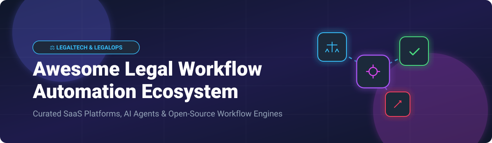

  

# ⚖️ Awesome Legal Workflow Automation 🤖

  
  
  
  

## 🚀 Top Legal Workflow Automation Platforms & Open-Source Tools Ecosystem
> **A curated list of SaaS legal operations platforms 🏢, AI intake-to-resolution systems 🤖, no-code decision tree engines 🌳, and open-source workflow frameworks ⚡.**

**📅 Last updated: September 2026**

The **Legal Workflow Automation & LegalOps Software Sector** 📊 is currently valued at an estimated market size of **$2.8 Billion - $3.5 Billion**, projected to reach over **$7.5 Billion** by 2030 (CAGR ~14.2%). The market is **moderately fragmented**: while cloud enterprise giants (such as ServiceNow) capture general IT/enterprise workflows, specialized legal intake, triage, document generation, and decision-logic automation remain split across specialized enterprise SaaS category leaders and emerging open-source agent ecosystems.

---

## 📑 Table of Contents
- [🏢 SaaS & Enterprise Hosted Platforms](#-saas--enterprise-hosted-platforms)
- [💻 Open-Source GitHub Projects](#-open-source-github-projects)
- [🏗️ Architecture & Implementation Patterns](#️-architecture--implementation-patterns)
- [🤝 Support & Sponsorship](#-support--sponsorship)
- [📈 Star History](#-star-history)
- [🛠️ How to Contribute](#️-how-to-contribute)
- [⚠️ Disclaimer](#️-disclaimer)

---

## 🏢 SaaS & Enterprise Hosted Platforms

Below is a comparison of top enterprise legal workflow automation platforms, ordered by company size (valuation / annual revenue descending).

| Platform | Company Size (Valuation / Revenue) 📈 | Starting Tier Pricing 🏷️ | Free Tier / Trial Limits ⏳ | Primary Focus & Description 📝 |
| :--- | :--- | :--- | :--- | :--- |
| **[ServiceNow Legal](https://www.servicenow.com/)** | **$137 Billion** Market Cap / **$13.3 Billion** Revenue | **$100 / user / month** (ServiceNow Enterprise Legal Service Management tier) | **15-Day Personal Developer Instance (PDI)** trial with full workflow capabilities | Enterprise legal service management, intake triage, and cross-departmental workflow orchestration. |
| **[Mitratech TAP Workflow](https://mitratech.com/)** | **$1.55 Billion** Valuation / **$222.2 Million** Revenue | **$15,000 / year** (Base TAP Workflow Automation Suite) | **No Free Trial**; custom sandbox environment available upon demo request | Enterprise legal operations, matrixed approval workflows, and intake automation. |
| **[Onit Apptitude](https://www.onit.com/)** | **$234.7 Million** Total Funding / **$54.5 Million** ARR | **$12,000 / year** (Base Legal Ops & Workflow Suite) | **14-Day Limited Trial** (available for select modules like ContractWorks) | Matter management, intake triage, and customizable workflow applications for corporate legal. |
| **[LawVu](https://lawvu.com/)** | **$400 Million NZD** (~$245M USD) Valuation / **$20 Million** ARR | **$9,600 / year** (Standard LegalOS base pack) | **14-Day Trial** (specifically for LawVu Draft module; demo required for full suite) | Unified Legal Operating System (LegalOS) for in-house teams covering contracts, intake, and spend. |
| **[BRYTER](https://bryter.com/)** | **$264 Million** Valuation / **$12 Million** ARR | **$15,000 / year** (Base Builder Tier) | **14-Day Sandbox Trial** for enterprise demo evaluators | No-code decision tree automation, rule-heavy compliance workflows, and legal bot builder. |
| **[DoNotPay Business](https://donotpay.com/)** | **$210 Million** Valuation | **$36 / 3 months** ($12 / month equivalent) | **No Free Trial** for own app; includes virtual "Free Trial Card" feature for third-party tools | Consumer and administrative micro-legal automation tools and dispute filing. |
| **[Checkbox](https://www.checkbox.ai/)** | **$100 Million** Valuation / **$23 Million** Series A | **$10,000 / year** (Starter Legal Front Door tier) | **No Free Trial**; interactive live demo sessions provided upon request | AI-powered legal front door, automated intake triage, NDA self-service, and approval routing. |
| **[LegalFly](https://www.legalfly.com/)** | **$18.5 Million** Funding | **$12,000 / year** (Legal AI Workspace base subscription) | **No Free Trial**; custom pilot access granted post sales demo | Agentic AI legal workspace for document review, contract drafting, and playbook enforcement. |
| **[Josef](https://joseflegal.com/)** | **$8.7 Million AUD** (~$5.7M USD) Funding | **$6,000 / year** (Builder Tier) | **No Free Trial**; structured access through builder programs and requested demos | No-code visual flowchart bot builder and AI policy Q&A assistant (Josef Q). |
| **[Neota Logic](https://www.neotalogic.com/)** | **Independently Operated** (Bootstrapped / Private) | **$18,000 / year** (Per-solution tiered subscription + discovery sprint) | **No Free Trial**; custom MVP discovery sprint available for prospective accounts | Complex rule-based expert systems, multi-path legal applications, and compliance logic. |

---

## 💻 Open-Source GitHub Projects

Curated open-source projects, workflow engines, and frameworks for legal process automation, ordered by GitHub Stars_Count descending.

| Project & Repository 📦 | Stars_Count ⭐ | Category 🏷️ | Description 📝 |
| :--- | :--- | :--- | :--- |
| **[n8n](https://github.com/n8n-io/n8n)** |  | Workflow Automation Platform | Fair-code workflow automation tool with node-based logic for integrating legal intake, Slack/Teams, AI agents, and document generation. |
| **[Appsmith](https://github.com/appsmithorg/appsmith)** |  | Internal Tool & Form Builder | Open-source low-code framework to quickly build custom legal request portals, internal review dashboards, and matter management tools. |
| **[Activepieces](https://github.com/activepieces/activepieces)** |  | Open-Source Automation | No-code business automation tool with 100+ connectors, ideal for routing legal requests, document triggers, and approval chains. |
| **[Temporal](https://github.com/temporalio/temporal)** |  | Microservice Orchestration Engine | Open-source durable execution engine for resilient multi-step legal workflows, compliance tracking, and background document processing. |
| **[Documenso](https://github.com/documenso/documenso)** |  | Open-Source Document Signing | Open-source alternative to DocuSign for embedding digital signatures, approvals, and contract execution into automated legal pipelines. |
| **[Flowable](https://github.com/flowable/flowable-engine)** |  | BPMN / CMMN Engine | Lightweight Java-based business process management engine supporting BPMN 2.0 and case management for legal triage. |
| **[Camunda](https://github.com/camunda/camunda)** |  | Process Orchestration Platform | Enterprise-grade process orchestration engine (BPMN/DMN) suitable for complex legal decision-logic and approval pipelines. |
| **[Form.io](https://github.com/formio/formio)** |  | Dynamic Form & API Builder | Combined JSON form builder and API platform for building structured legal intake questionnaires and self-service portals. |
| **[Docassemble](https://github.com/jhpyle/docassemble)** |  | Guided Interviews & Doc Assembly | Python/YAML/Markdown expert system created specifically for legal document automation, guided client interviews, and court form filing. |
| **[Open Decision](https://github.com/open-decision/open-decision)** |  | No-Code Legal Decision Trees | Open-source visual decision tree builder for legal automation, enabling non-technical teams to turn legal logic into interactive tools. |

---

## 🏗️ Architecture & Implementation Patterns

**Building a Custom Self-Hosted Legal Automation Stack:** 💡
1. **📥 Intake & Triage**: Capture legal requests via [Form.io](https://github.com/formio/formio) or [Appsmith](https://github.com/appsmithorg/appsmith).
2. **🧠 Decision & Business Logic**: Execute decision trees with [Open Decision](https://github.com/open-decision/open-decision) or BPMN engines like [Camunda](https://github.com/camunda/camunda) / [Flowable](https://github.com/flowable/flowable-engine).
3. **📄 Document Assembly**: Generate custom legal contracts using [Docassemble](https://github.com/jhpyle/docassemble).
4. **✍️ Execution & E-Signatures**: Route finished documents for digital signature using [Documenso](https://github.com/documenso/documenso).
5. **🔄 Orchestration & Audit Logging**: Connect services via [n8n](https://github.com/n8n-io/n8n) or durable execution with [Temporal](https://github.com/temporalio/temporal) to maintain an audit trail for legal defensibility.

---

## 💖 Support & Sponsorship

Thank you for exploring this curated ecosystem! 🌟 If this resource has helped your legal operations team, law firm, or open-source legal tech workflow research, please consider supporting the project:

- 🌟 **Star this repository** to help others discover it!
- 🍴 **Fork & Share** with fellow legal tech developers and legal ops professionals.
- ☕ **Buy me a coffee**: Support ongoing maintenance and curation on the [Sponsor Dashboard](https://github.com/sponsors/ishandutta2007).

---

## 📈 Star History

---

## 🛠️ How to Contribute

Contributions are highly encouraged! 🎁 To add or update an entry:
1. Fork this repository.
2. Edit `README.md` to add your SaaS platform or Open-Source project under the relevant section.
3. Ensure all links, pricing data, and Stars_Count badges follow the existing markdown table structure.
4. Open a Pull Request with a short summary of the additions.

---

## ⚠️ Disclaimer

- This is a **community-curated** list — not exhaustive and not an endorsement.
- Legal workflow systems handle privileged and confidential information. They must support attorney-client privilege, data security, and applicable professional conduct rules. Automated outputs are not legal advice and require qualified attorney review. Open-source or self-built solutions need rigorous security, access control, and legal oversight before production use. This list is not legal advice.

---
**Made with ❤️ for legal operations, general counsel, and law firm teams who need efficient, auditable process automation.**
